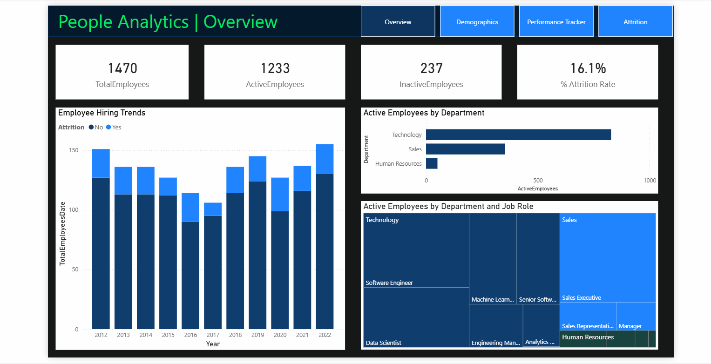

# 📊 HR Analytics Dashboard

## 📌 Overview
This project is a comprehensive People Analytics dashboard built in Power BI. It focuses on employee retention, performance, and demographic insights to help HR teams make data-driven decisions.

## 🎯 Objective
The dashboard aims to reduce attrition and improve employee satisfaction by answering key questions:
- What are the primary drivers of employee turnover?
- How does performance correlate with satisfaction and training?
- What is the demographic composition of the workforce?

## 📂 Dataset
The analysis is based on a star-schema dataset featuring:
- **Employee.csv**: Core table with 1,470+ records including:
    - **Attrition Status**: Key target variable.
    - **Demographics**: Age, Gender, Ethnicity, Marital Status.
    - **Job Details**: Department, Role, Salary, Business Travel, Overtime.
- **PerformanceRating.csv**: Review data including Self & Manager ratings, Job Satisfaction, and Work-Life Balance scores.
- **Dimension Tables**: EducationLevel, RatingLevel, SatisfiedLevel for standardized grouping.

## 📈 Dashboard Insights
- **Attrition Analysis**: Breakdown of attrition by Department, Age Group, and Tenure. Highlighting risk factors like "Frequent Travel" or "Overtime".
- **Performance vs. Satisfaction**: Correlating Manager Ratings with Job Satisfaction and Environment Satisfaction.
- **Workforce Diversity**: Visualizing gender and ethnicity distribution across different job roles.
- **Training Effectiveness**: Analyzing if training opportunities taken impact performance or retention.

## 🛠️ Tools & Technologies
- **Power BI**: Main visualization tool using DAX for measures (e.g., Attrition Rate, Avg Satisfaction).
- **Data Modeling**: Star schema with one-to-many relationships between Dimension and Fact tables.
- **Power Query**: Likely used for data cleaning and merging rating descriptions.

## 📊 Key Features
- **Attrition KPI Cards**: Quick view of Attrition Rate and Total Active Employees.
- **Interactive Slicers**: Filter by Department, Job Role, and Gender.
- **Matrix Views**: Detailed breakdown of Rating vs. Satisfaction.
- **Trend Analysis**: Hiring trends over time (using `DimDate`).

## 🧠 Business Impact
This dashboard empowers HR leaders to:
- **Proactively Retain Talent**: Identify at-risk employees based on risk factors (e.g., Low Salary + High Overtime).
- **Optimize Training**: Allocate training budget to where it yields highest performance improvements.
- **Improve Culture**: Address specific areas of dissatisfaction (Environment vs. Relationship).

## 🎥 Dashboard Preview

## 🚀 How to Use
1. **Open the File**: Launch `People_Analytics.pbix` in Power BI Desktop.
2. **Explore Tabs**: Navigate between "Overview", "Demographics", and "Performance" pages (if applicable).
3. **Filter Data**: Use the side panel slicers to focus on specific departments (e.g., R&D vs Sales).
