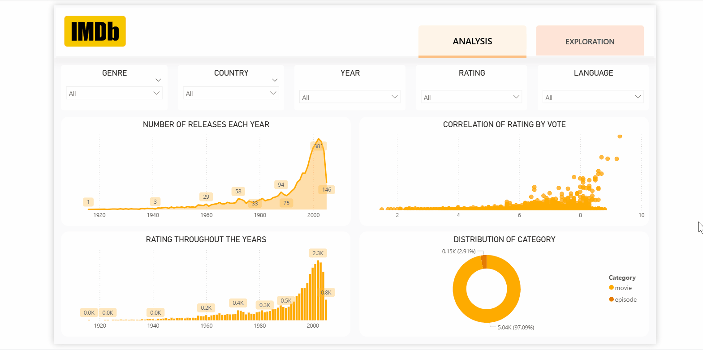

# 🎬 IMDb Analytics Dashboard

## 📌 Overview
This project provides a deep dive into the world of movies and TV shows using IMDb data. It allows users to explore trends in ratings, popularity, and production across different genres and decades.

## 🎯 Objective
The dashboard helps film enthusiasts and analysts understand:
- Which genres generate the highest ratings?
- Who are the most prolific and highly-rated directors/actors?
- How has content production evolved over the years?
- What are the characteristics of top-rated titles?

## 📂 Dataset
The analysis is based on `imdb_processed.csv`, a clean dataset containing metrics for thousands of titles. Key columns include:
- **Title Metrics**: `Title`, `Year`, `Runtime`, `Kind` (Movie, TV Series, Episode).
- **Engagement**: `Rating` (0-10), `Vote` (Number of votes).
- **Metadata**: `Genre`, `Country`, `Language`.
- **Credits**: `Cast`, `Director`, `Writer`, `Composer`.

## 📈 Dashboard Insights
- **Top Lists**: Highest-rated movies and TV shows by genre.
- **Genre Analysis**: Vote distribution and average rating per genre (e.g., Drama vs. Sci-Fi).
- **Time Trends**: Evolution of movie content and ratings from the early 20th century to present.
- **Talent Spotlight**: Analysis of directors and actors associated with high-performing content.
- **Geographic Distribution**: Content production by country.

## 🛠️ Tools & Technologies
- **Power BI**: For building interactive visualizations and filtering by Genre/Year.
- **Python (Pandas)**: Used for data cleaning and preprocessing (evident from `IMDB Notebook.ipynb` and `imdb_processed.csv`).
- **Data Transformation**: Handling list-type columns (e.g., extracting multiple genres or actors from string arrays).

## 📊 Key Features
- **Search & Filter**: Ability to find metrics for specific titles or directors.
- **Interactive Ratings Map**: Visualizing global content distribution.
- **Genre Performance Matrix**: Heatmaps or bar charts comparing genre success.
- **Rich Tooltips**: Hover details showing cast and crew for individual titles.

## 🧠 Business Impact
- **Content Strategy**: Helps producers identify high-performing genres and themes.
- **Casting Decisions**: Highlights bankable actors and directors.
- **Market Trend Analysis**: Understanding potential shifts in audience preference over time.

## 🎥 Dashboard Preview

## 🚀 How to Use
1. **Open the Report**: Launch `IMDb Dashboard.pbix` in Power BI Desktop.
2. **Interact**: Use slicers to select a specific `Genre` or `Year` range.
3. **Drill Down**: Click on a director's name to see their filmography and average ratings.
